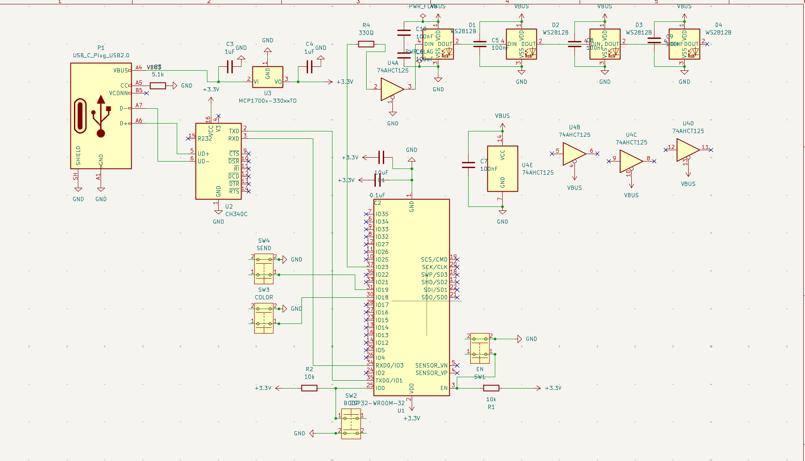
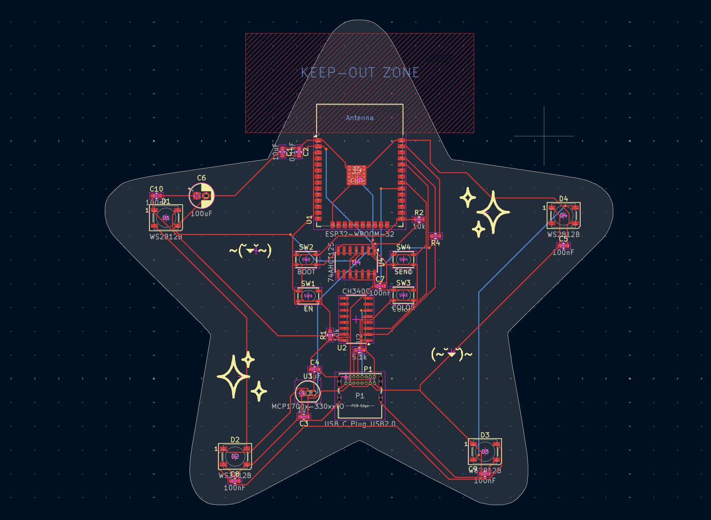
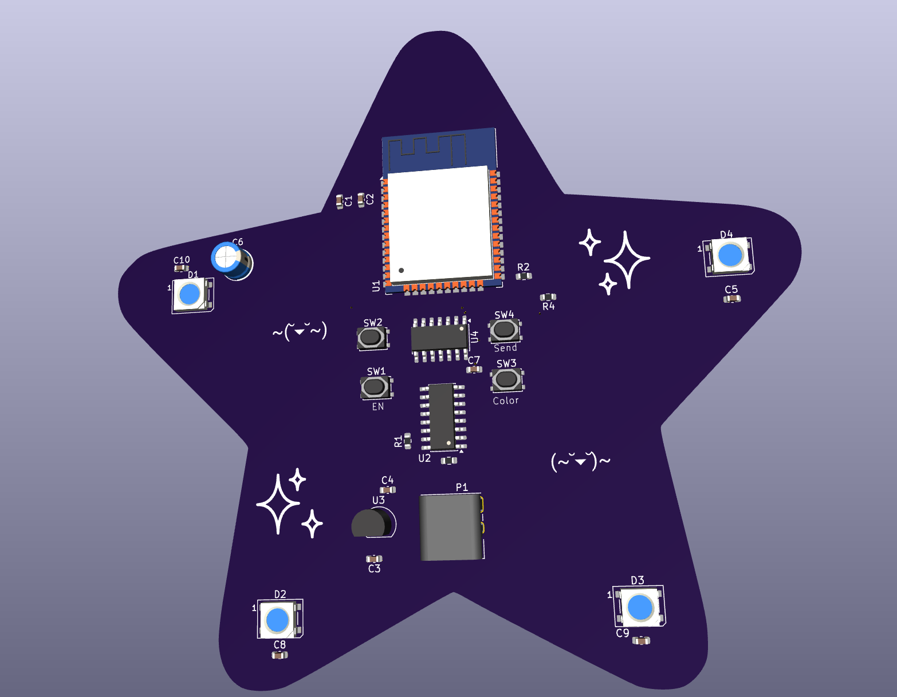

# Mood Star Keychain
A cute and aesthetic star keychain that allows you to communicate your mood to your friends!

## THIS PROJECT IS IN PROGRESS

## Features
- 4 Neopixels to allow for aesthetic lighting
- WiFi based communication with friends
- USB C port for easy power and programming

### Schematic

### PCB

### 3dmodel

### Next steps:
- Get PCB board and componenets and solder everything
- Edit firmware in accordance to the Neopixels added
- Aestheticize using pipe cleaners

### BOM
| Index                    | LCSC#     | MPN                 | Manufacturer                | Package              | Customer # | Description                                                                                 | RoHS | Quantity | MOQ | Multiple | Unit Price($) | Extended Price($) | Product Link                                       |
|--------------------------|-----------|---------------------|-----------------------------|----------------------|------------|---------------------------------------------------------------------------------------------|------|----------|-----|----------|---------------|-------------------|----------------------------------------------------|
| 1                        | C19702    | CL10A106KP8NNNC     | Samsung Electro-Mechanics   | 603                  |            | 10uF ±10% 10V Ceramic Capacitor X5R 0603                                                    | yes  | 20       | 20  | 20       | 0.0265        | 0.53              | https://www.lcsc.com/product-detail/C19702.html    |
| 2                        | C14663    | CC0603KRX7R9BB104   | YAGEO                       | 603                  |            | 100nF ±10% 50V Ceramic Capacitor X7R 0603                                                   | yes  | 100      | 100 | 100      | 0.0172        | 1.72              | https://www.lcsc.com/product-detail/C14663.html    |
| 3                        | C15849    | CL10A105KB8NNNC     | Samsung Electro-Mechanics   | 603                  |            | 1uF ±10% 50V Ceramic Capacitor X5R 0603                                                     | yes  | 50       | 50  | 50       | 0.0148        | 0.74              | https://www.lcsc.com/product-detail/C15849.html    |
| 4                        | C49256785 | ERA10V100M5X7       | JIERR                       | Through Hole,D5xL7mm |            | 100uF 10V Aluminum Electrolytic Capacitors Through Hole,D5xL7mm 2000hrs@105℃                | yes  | 20       | 20  | 20       | 0.0246        | 0.49              | https://www.lcsc.com/product-detail/C49256785.html |
| 5                        | C2761795  | WS2812B-B/T         | Worldsemi                   | SMD5050-4P           |            | SMD5050-4P LED Addressable, Specialty RoHS                                                  | yes  | 10       | 5   | 5        | 0.1072        | 1.07              | https://www.lcsc.com/product-detail/C2761795.html  |
| 6                        | C25804    | 0603WAF1002T5E      | UNI-ROYAL                   | 603                  |            | 10kΩ ±1% 100mW 0603 Thick Film Resistor                                                     | yes  | 100      | 100 | 100      | 0.0012        | 0.12              | https://www.lcsc.com/product-detail/C25804.html    |
| 7                        | C23186    | 0603WAF5101T5E      | UNI-ROYAL                   | 603                  |            | 5.1kΩ ±1% 100mW 0603 Thick Film Resistor                                                    | yes  | 100      | 100 | 100      | 0.0018        | 0.18              | https://www.lcsc.com/product-detail/C23186.html    |
| 8                        | C23138    | 0603WAF3300T5E      | UNI-ROYAL                   | 603                  |            | 330Ω ±1% 100mW 0603 Thick Film Resistor                                                     | yes  | 100      | 100 | 100      | 0.0016        | 0.16              | https://www.lcsc.com/product-detail/C23138.html    |
| 9                        | C116501   | PTS810SJM250SMTRLFS | C&K                         | SMD-4P,4.2x3.2mm     |            | Tactile Switch SPST 160gf 2.5mm J-Lead 4.2mm x 3.2mm Surface Mount                          | yes  | 8        | 1   | 1        | 0.5771        | 4.62              | https://www.lcsc.com/product-detail/C116501.html   |
| 10                       | C82899    | ESP32-WROOM-32-N4   | ESPRESSIF                   | SMD,25.5x18mm        |            | 2.4GHz ESP32-DOWDQ6 -98dBm SMD,25.5x18mm RF Transceiver Modules and Modems RoHS             | yes  | 2        | 1   | 1        | 4.3259        | 8.65              | https://www.lcsc.com/product-detail/C82899.html    |
| 11                       | C84681    | CH340C              | WCH                         | SOP-16               |            | Transceiver 2Mbps USB 2.0 SOP-16 Interface Controllers RoHS                                 | yes  | 2        | 1   | 1        | 0.5863        | 1.17              | https://www.lcsc.com/product-detail/C84681.html    |
| 12                       | C511277   | MCP1700-3302E/TO    | MICROCHIP                   | TO-92-3              |            | 3.3V Positive Fixed TO-92-3 Voltage Regulators - Linear, Low Drop Out (LDO) Regulators RoHS | yes  | 2        | 1   | 1        | 0.803         | 1.61              | https://www.lcsc.com/product-detail/C511277.html   |
| 13                       | C155176   | SN74AHCT125DR       | TI                          | SOIC-14              |            | 4.5V~5.5V 1 4 20uA 7.5ns@5V,50pF SOIC-14 Buffers, Drivers, Receivers, Transceivers RoHS     | yes  | 2        | 1   | 1        | 0.3503        | 0.7               | https://www.lcsc.com/product-detail/C155176.html   |
| 14                       | C7095263  | USB4085-GF-A        | Global Connector Technology | Through Hole         |            | USB 2.0 5A 1 -40℃~+85℃ Right Angle Through Hole USB, DVI, HDMI Connector Assemblies RoHS    | yes  | 2        | 1   | 1        | 1.4228        | 2.85              | https://www.lcsc.com/product-detail/C7095263.html  |
| 15                       |           |                     | JLCPCB                      |                      |            | PCB                                                                                         |      | 5        | 5   |          |               | $8.40             |                                                    |
|                          |           |                     |                             |                      |            |                                                                                             |      |          |     |          |               |                   |                                                    |
| TOTAL (Without Shipping) | $33.01    |                     |                             |                      |            |                                                                                             |      |          |     |          |               |                   |                                                    |
| TOTAL (With Shipping)    | $71.42    |                     |                             |                      |            |                                                                                             |      |          |     |          |               |                   |                                                    |
### Timelapses 
- [1: Starting Out](https://lapse.hackclub.com/timelapse/5bXvsicgwVzP)
- [2: Basic Firmware](https://lapse.hackclub.com/timelapse/i8mPg4Ti3nzj)
- [3: Schematic](https://lapse.hackclub.com/timelapse/T4jO5MK8scFe)
- [4: General PCB](https://lapse.hackclub.com/timelapse/qJWxwG7Hxz8r)
- [5: Finalized PCB](https://lapse.hackclub.com/timelapse/edrZpXVRfG2W)
- [6: Manufacturing](https://lapse.hackclub.com/timelapse/CAW8ewQiKnNG)

### Libraries needed
umqttsimple.py: https://raw.githubusercontent.com/RuiSantosdotme/ESP-MicroPython/master/code/MQTT/umqttsimple.py 